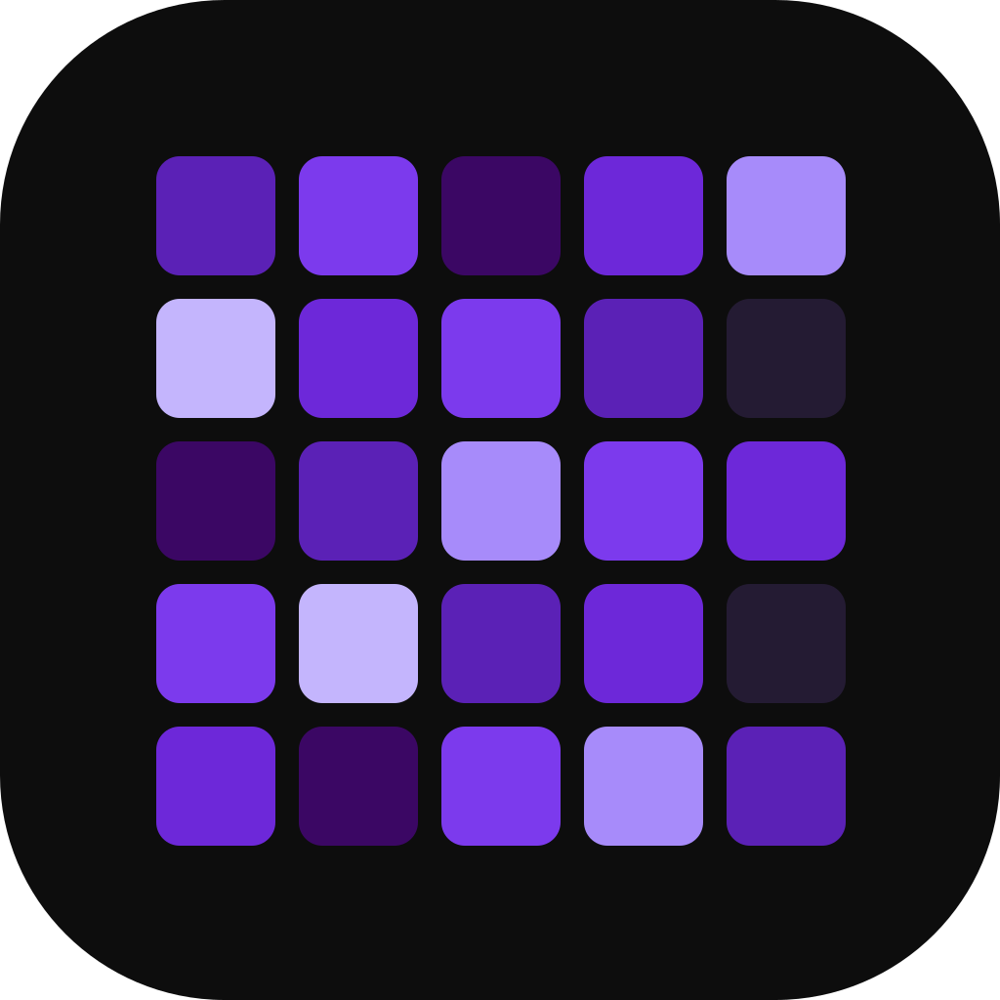

---

  <a href="../README.md">English</a> · <b>Español</b> · <a href="README.zh-CN.md">中文</a> · <a href="README.ru.md">Русский</a>

### Streak

### Un rastreador de hábitos minimalista, privado y sin anuncios

Registra un hábito con un solo toque, mantén tu constancia y mira crecer tus rachas.

 

  
  
  
  
  
  

 

&nbsp;

&nbsp;

&nbsp;

&nbsp;
<a href="https://apps.obtainium.imranr.dev/redirect?r=obtainium://app/%7B%22id%22%3A%22com.streak.app%22%2C%22url%22%3A%22https%3A%2F%2Fgithub.com%2FInlitX%2Fstreak%22%2C%22author%22%3A%22InlitX%22%2C%22name%22%3A%22Streak%22%2C%22preferredApkIndex%22%3A0%2C%22additionalSettings%22%3A%22%7B%5C%22includePrereleases%5C%22%3Afalse%2C%5C%22fallbackToOlderReleases%5C%22%3Atrue%2C%5C%22filterReleaseTitlesByRegEx%5C%22%3A%5C%22%5C%22%2C%5C%22filterReleaseNotesByRegEx%5C%22%3A%5C%22%5C%22%2C%5C%22verifyLatestTag%5C%22%3Afalse%2C%5C%22dontSortReleasesList%5C%22%3Afalse%2C%5C%22useLatestAssetDateAsReleaseDate%5C%22%3Afalse%2C%5C%22trackOnly%5C%22%3Afalse%2C%5C%22versionExtractionRegEx%5C%22%3A%5C%22%5C%22%2C%5C%22matchGroupToUse%5C%22%3A%5C%22%5C%22%2C%5C%22versionDetection%5C%22%3Atrue%2C%5C%22releaseDateAsVersion%5C%22%3Afalse%2C%5C%22useVersionCodeAsOSVersion%5C%22%3Afalse%2C%5C%22apkFilterRegEx%5C%22%3A%5C%22%5C%22%2C%5C%22invertAPKFilter%5C%22%3Afalse%2C%5C%22autoApkFilterByArch%5C%22%3Atrue%2C%5C%22appName%5C%22%3A%5C%22%5C%22%2C%5C%22shizukuPretendToBeGooglePlay%5C%22%3Afalse%2C%5C%22allowInsecure%5C%22%3Afalse%2C%5C%22exemptFromBackgroundUpdates%5C%22%3Afalse%2C%5C%22skipUpdateNotifications%5C%22%3Afalse%2C%5C%22about%5C%22%3A%5C%22Streak%20is%20an%20open%20source%20habit%20tracker%20for%20Android.%20Build%20habits%20with%20one%20tap%2C%20watch%20your%20progress%20grow%2C%20and%20keep%20everything%20on%20your%20device.%20No%20accounts%2C%20no%20ads%2C%20no%20tracking.%5C%22%7D%22%2C%22overrideSource%22%3Anull%7D"></a>

 

  <a href="#características">Características</a> ·
  <a href="#vienes-de-otra-app">Importar</a> ·
  <a href="#descarga">Descarga</a> ·
  <a href="#privacidad">Privacidad</a> ·
  <a href="#traducciones">Traducciones</a> ·
  <a href="#apoyo">Apoyo</a>

---

<b>Hoy</b> · <b>Concentración</b> · <b>Estadísticas</b> · <b>Análisis</b> · <b>Cantidades</b> · <b>Notas</b> · <b>Personaliza</b> · <b>Libre y privada</b>

---

## Resumen

Streak es un rastreador de hábitos de código abierto para Android que te respeta.
Crea todos los hábitos que quieras, regístralos con un toque y mira tu progreso
crecer en una cuadrícula de actividad al estilo de GitHub, contadores de racha y
un panel de estadísticas.

Es rápido, funciona sin conexión y está pensado para transmitir calma en lugar de
exigir.

---

## Características

<table>
<tr>
<td width="50%" valign="top">

### Seguimiento

- Registro con un toque desde la pantalla de inicio, un widget o la
  notificación
- Tres tipos de hábito: **normal**, **evitar** (con recaídas) y **cantidad**,
  con tu unidad y tu meta diaria
- Las **listas de pasos** dividen un hábito en partes, hecho al marcarlas todas
- **Horarios flexibles**: diario, X veces por semana o mes, días concretos o
  cada N días
- **Rellena el pasado**: toca cualquier día para añadirlo o quitarlo
- **Notas del día**: mantén pulsado un día para contar qué pasó o añadir una
  foto
- El **modo vacaciones** pausa un hábito sin romper nada

</td>
<td width="50%" valign="top">

### Ver tu progreso

- **Cuadrícula de actividad** al estilo de GitHub, por semana, mes o año entero
- **Calendario mensual**, con la semana empezando en lunes, sábado o domingo
- **Completados por mes**, para ver la forma de un año entero
- **Evolución de la racha** en una gráfica, para verla subir
- **"¿Cuándo eres más constante?"** encuentra las horas a las que de verdad
  cumples
- Totales, mejor racha, racha actual, cumplimiento y una puntuación de
  **fuerza** por hábito
- Una **tarjeta de progreso** para compartir, en varios tamaños y exportada
  como imagen cuidada

</td>
</tr>
<tr>
<td width="50%" valign="top">

### Sesiones de concentración

- Un temporizador para los hábitos que lo piden, libre o atado a un hábito y
  su meta
- **Rondas pomodoro** con descansos cortos, o una sola sesión larga
- Tres estilos de reloj: **Círculo**, **Flip** y **Puntos**
- Sonidos incluidos (lluvia, ruido marrón, pad cálido) o tus propias pistas,
  en orden o aleatorias
- Escenas tranquilas de fondo, o una foto tuya
- Marca subtareas sin salir del temporizador, y deja la pantalla encendida
- Una **meta diaria de concentración**, más el historial de cada sesión

</td>
<td width="50%" valign="top">

### Hacerla tuya

- **Clásico, Minimal o Express**: tres diseños completos, cada uno con su
  cuadrícula con todo agrupado en cuatro secciones
- Pack de iconos minimalista, o cualquier emoji que quieras
- Color de acento personalizado con selector completo
- Temas claro y oscuro, más cinco fondos: sólido, degradado, puntos, negro
  puro OLED o una foto tuya
- Portadas, categorías, reordenar arrastrando, nombre y foto de perfil
- Tres iconos de aplicación, para que Streak pegue con tu pantalla de inicio
- Una lluvia de confeti el día que lo completas todo

</td>
</tr>
<tr>
<td width="50%" valign="top">

### Recordatorios y widgets

- Recordatorios por hábito, los días que elijas o cada N días, cada uno con
  una frase de ánimo
- Botones de **Hecho**, **Posponer** y **Añadir cantidad** en la propia
  notificación
- **Cuatro widgets de inicio**: hábito, hoy, estadísticas y cuadrícula de
  actividad
- Cada widget con su estilo propio: color o foto, opacidad y borde
- Elige qué datos muestra el **widget de estadísticas** y cómo se colocan
- Marca un día desde el widget, se guarda sin abrir la app
- Toca la cuadrícula de actividad para entrar directo en ese hábito

</td>
<td width="50%" valign="top">

### Tus datos

- **Importa** desde Loop Habit Tracker, HabitKit, Habitica y HabitBull, con
  historial y rachas, o desde cualquier CSV con un hábito y una fecha
- Copia de seguridad y restauración en un solo archivo que guardas tú
- **Copias automáticas**, diarias o semanales, en la carpeta que elijas
- **Bloqueo de la app** con PIN o huella, para móviles que no lo traen
- **Archiva** hábitos sin perder un solo día de su historial
- Todo sin conexión: sin cuenta, sin servidor, nada que sincronizar
- Siete idiomas, con más abiertos en Weblate

</td>
</tr>
</table>

---

## ¿Vienes de otra app?

<b>Cómo funciona la importación</b>

Tráete tu historial. Streak lee exportaciones de **Loop Habit Tracker**,
**HabitKit**, **Habitica** y **HabitBull**, así que tus días pasados y tus
rachas sobreviven a la mudanza. Cualquier otro CSV vale también, mientras tenga
un hábito y una fecha.

<b>Ajustes → Datos → Importar de otra app</b>

---

## Descarga

[**F-Droid**](https://f-droid.org/packages/com.streak.app/) es lo más cómodo:
instala Streak y lo mantiene actualizado por ti. También está en
[**IzzyOnDroid**](https://apt.izzysoft.de/fdroid/index/apk/com.streak.app?repo=main)
y [**OpenAPK**](https://www.openapk.net/streak/com.streak.app/).

Streak funciona en Android, Windows y Linux:

| Plataforma | Estado |
|------------|--------|
| Android | ✅ Compatible |
| Windows | ✅ Compatible |
| Linux | ✅ Compatible |
| iOS | 🚧 En curso |
| macOS | 📅 Planeado |

<b>Linux</b>

Dos ficheros en la página de [**Releases**](https://github.com/InlitX/streak/releases),
los dos para x86 de 64 bits:

| Fichero | Para |
|---------|------|
| `Streak-x86_64.AppImage` | Cualquier distribución: dale permiso de ejecución y ábrelo |
| `Streak-linux-x64.tar.gz` | Descomprímelo donde quieras y ejecuta `Streak` |

La versión de Linux acaba de salir, así que es normal que tenga algún fallo. Los
recordatorios suenan mientras Streak esté abierto. Si algo no va, abre un issue y
lo iré arreglando.

<b>Instalar el APK por tu cuenta</b>

¿Prefieres el APK directo? Está en la página de
[**Releases**](https://github.com/InlitX/streak/releases), un archivo por tipo de
teléfono para que cada descarga sea pequeña:

| APK | Para |
|-----|------|
| `Streak-arm64-v8a.apk` | Teléfonos modernos de 64 bits, **elige este** |
| `Streak-armeabi-v7a.apk` | Dispositivos antiguos de 32 bits |
| `Streak-x86_64.apk` | Emuladores y tablets x86 |

Funciona en **Android 9 (Pie) o superior**.

Si instalas el APK por tu cuenta, [**Obtainium**](https://github.com/ImranR98/Obtainium)
te lo mantiene al día: añade `https://github.com/InlitX/streak` y seguirá la
página de Releases, te avisará cuando salga una versión nueva y elegirá el APK
que le toca a tu teléfono.

> [!NOTE]
>Streak no está en la Play Store. Como el APK no viene de una tienda, puede que
>Android te pida permitir instalaciones desde tu navegador o gestor de archivos
>la primera vez.

---

## Privacidad

> [!IMPORTANT]
>Streak **no tiene analíticas, ni SDK de publicidad, ni backend de red**. La app
>nunca envía tus datos a ningún sitio: se quedan en tu dispositivo. Las únicas
>acciones salientes son los enlaces que tú decides abrir.

---

## Traducciones

Streak habla **inglés, español, francés, portugués, ruso, ucraniano y chino**
por completo, y **alemán, polaco, hebreo, indonesio y persa** están en camino;
cualquier idioma nuevo es bienvenido. Las
traducciones se gestionan en [**Weblate**](https://hosted.weblate.org/engage/streak/):
no hace falta programar, solo son frases cortas que traduces en el navegador.

Cómo funciona → [**TRANSLATING.md**](../TRANSLATING.md)

---

## Contribuir

Los informes de fallos, las ideas y los pull requests son bienvenidos, mira
[**CONTRIBUTING.md**](../CONTRIBUTING.md). Para algo más grande que un arreglo, abre
antes una incidencia y acordamos la dirección.

---

## Inspiración

<b>Las apps que la moldearon</b>

Streak no salió de la nada. Estas son las apps que la moldearon:

- **[Loop Habit Tracker](https://github.com/iSoron/uhabits)**, por demostrar que
  un rastreador de hábitos puede ser libre, sin conexión y excelente sin ruido.
- **[Grit](https://github.com/shub39/Grit)**, por el acabado: los movimientos
  pequeños y esa sensación de que la lista está viva.
- **[HabitKit](https://www.habitkit.app/)**, por enseñar lo bien que se ve un año
  de historial en una rejilla de colores.
- **[Habitica](https://github.com/habitRPG/habitica)**, por tratar el aparecer cada día como
  algo que merece celebrarse.

La isla que se construye en la pestaña de gamificación está dibujada con
**[Mykonos Island Voxels](https://github.com/boona13/mykonos-island-voxels)** de
boona13, un juego de arte isométrico de voxel con licencia MIT. Gracias por
publicarlo para que cualquiera pueda usarlo.

Aquí no hay nada copiado de ellas. Sus ideas fueron el punto de partida y Streak
siguió su propio camino.

---

## Apoyo

Streak es gratis, de código abierto y sin anuncios, y así se queda.

Si te ayuda a mantener la constancia, con eso ya me vale. Y si además te apetece
devolver algo, una estrella, una traducción o un informe de fallo bien contado
ayudan tanto como un café.

<b>Monederos de cripto</b>

<table align="center">
  <tr>
    <td align="center" width="130"> <b>Bitcoin</b></td>
    <td><code>bc1qm0r4pg8nknnjh3a7n2t63ckafhsz8jdd6qer29</code></td>
  </tr>
  <tr>
    <td align="center" width="130"> <b>Ethereum</b></td>
    <td><code>0x34b7A5552132cBca150Ae29c1E632faA49430e1a</code></td>
  </tr>
  <tr>
    <td align="center" width="130"> <b>Solana</b></td>
    <td><code>DC8dNEUNJhWdtBHBZAn4FTheVC3W4PtkGhbazvtk17Jo</code></td>
  </tr>
  <tr>
    <td align="center" width="130"> <b>Monero</b></td>
    <td><code>44SECMEf3rfV228kpy3Gs48wLmLXnq231gAMG7ULYoCWBWLYLHdwYV7YFkhMk31DR5P7SRAyRPyhkYaehtgEoajASz7qubq</code></td>
  </tr>
</table>

 
 

<a href="https://www.star-history.com/?repos=InlitX%2Fstreak&type=date&legend=top-left">
 <picture>
   <source media="(prefers-color-scheme: dark)" srcset="https://api.star-history.com/chart?repos=InlitX/streak&type=date&theme=dark&legend=top-left&sealed_token=aNqDTOocHK1NkSrMsZrD1iFDpo1AtZvvUo3ZqETCzSujh-eSh0ekwpay4FpVGocizt1wmR5QWrkuMUAl2r9yllwF4v9e3tnsI6c1lv0upumuFVgsXGvAwA" />
   <source media="(prefers-color-scheme: light)" srcset="https://api.star-history.com/chart?repos=InlitX/streak&type=date&legend=top-left&sealed_token=aNqDTOocHK1NkSrMsZrD1iFDpo1AtZvvUo3ZqETCzSujh-eSh0ekwpay4FpVGocizt1wmR5QWrkuMUAl2r9yllwF4v9e3tnsI6c1lv0upumuFVgsXGvAwA" />
   
 </picture>
</a>

 
 

Publicado bajo la <a href="../LICENSE"><b>Licencia GNU GPLv3</b></a>.

